# System Map

This is the central interlink view of the Hive-Mind Memory Vault. It shows every system in
the operator's portfolio, grouped by domain cluster, and the edges that connect them:
dependencies, data flow, shared tooling, and ownership. Every node here resolves to a
`repo-registry/` entry, a `parties/` record, a `tools/` entry, or a `knowledge/` namespace.

The brain (this repo) is the catalog, doctrine, and interlink layer over the portfolio. Code
and content stay in their source repos; the brain points at them and selectively ingests
high-value knowledge.

## Identity map

- **Operator:** `cllmholmes` (GitHub: `cllmholmes-alt`). The internal operator, modeled in
  `knowledge/personal-operator/`.
- **Upstream origin of this brain:** `starmynd-org`. This repo was cloned from the
  `starmynd-org/infinite-brain-os` starter. It is NOT the operator's company.
- **Collaborative orgs in use:** `OCNAI` (AI-video-upscaler), `openclaw` (OpenClaw), and
  `rtk-ai` (RTK upstream).
- **Product brands:** `adhd-os`, `talos` (see `parties/brands/`).

## Portfolio topology

```mermaid
flowchart TD
  IB["infinite-brain-os<br/>Hive-Mind Vault<br/>(this repo)"]

  subgraph adhd["ADHD-OS brand cluster"]
    ADHDMDB["Master Reference DB<br/>(local, no git)"]
    ADHDALT["Alternative Design<br/>(local, no git)"]
    ADHDMONEY["ADHD-Money-Website<br/>(local, no git)"]
    ADHDWEB["AdhdosArtsyledWebsite<br/>(Vite web)"]
    ADHDDASH["User Dashboard<br/>(Expo mobile app)"]
  end

  subgraph agentic["Agentic systems cluster"]
    TALOS["TALOS<br/>(multi-agent OS)"]
    COS["Company-OS<br/>(AI dev company)"]
    ODY["odysseus-dev<br/>(self-hosted AI workspace)"]
    OCLAW["openclaw<br/>(upstream)"]
    NEMO["NemoClaw<br/>(operator fork)"]
  end

  subgraph mods["Game modding cluster"]
    CDMF["Crimson Desert Mod Forge<br/>(Vite)"]
    GACE["G.A.C.E<br/>(asset engine)"]
    FGM["Full Game Modding<br/>(local, no git)"]
  end

  subgraph media["AI media cluster"]
    AIVID["AI-video-upscaler<br/>(OCNAI)"]
    FLUID["FluidFrames<br/>(Djdefrag)"]
    GLMUI["GLM 5 Ultra Coder<br/>(local web UI)"]
  end

  subgraph rev["Revenue and business cluster"]
    HRIO["Hermes Revenue OS<br/>(Reddit lead pipeline)"]
    GRR["GetSubmitReady.com<br/>(App Review rescue)"]
    IPDF["InstantPDF Farm<br/>(local, no git)"]
  end

  subgraph platform["Shared platform tools"]
    RTK["RTK<br/>(LLM token proxy)"]
    COMFY["ComfyUI<br/>(image gen runtime)"]
    IOSMAC["ScaleWay iOS Cloud Mac<br/>(build and sign host)"]
    UNITY["Unity<br/>(game engine)"]
  end

  subgraph infra["Infrastructure and agentic platform"]
    VPS["Netcup VPS<br/>(Debian 13, 16CPU/31GB)"]
    HERMES["Hermes Agent<br/>(Nous Research)"]
    FUSION["Fusion API<br/>(6-layer router)"]
    AURORA["Aurora API<br/>(inference gateway)"]
  end

  subgraph solo["Standalone projects"]
    CNC["CNC Machine<br/>(hardware)"]
    HTSA["HTSA exosystem<br/>(hardware, local)"]
    OWES["OWES<br/>(offline web editor, local)"]
    WILLOW["WillowGlassArt<br/>(art site, local)"]
    AXIOM["axiom-next<br/>(Next.js scaffold)"]
    MMRRP["MMRRP<br/>(unclassified)"]
  end

  %% Brain governs and documents the whole portfolio
  IB -. documents .-> adhd
  IB -. documents .-> agentic
  IB -. documents .-> mods
  IB -. documents .-> media
  IB -. documents .-> rev

  %% ADHD-OS internal edges
  ADHDMDB --> ADHDWEB
  ADHDMDB --> ADHDDASH
  ADHDALT -. alternate design .-> ADHDWEB

  %% Agentic cluster edges
  OCLAW --> NEMO
  TALOS -. doctrine overlap .-> IB
  TALOS --- COS
  ODY --- OCLAW

  %% Modding edges
  GACE --> CDMF
  CDMF --- FGM

  %% Media edges
  AIVID --- FLUID
  COMFY --> AIVID
  COMFY --> WILLOW

  %% Revenue edges
  HRIO -->|"lead to"| CRMEXT["external CRM"]
  GRR -->|"checkout"| STRIPEEXT["external Stripe"]
  HRIO --- GRR
  GRR --- IPDF

  %% Platform tool edges
  RTK -->|"token proxy"| TALOS
  RTK -->|"token proxy"| ODY
  RTK -->|"token proxy"| NEMO
  RTK -->|"token proxy"| COS
  IOSMAC -->|"builds and signs"| ADHDDASH
  IOSMAC -->|"builds"| GRR
  UNITY --> GACE
  UNITY --> CDMF

  %% External LLM providers feed the agentic and media stacks
  LLMPROV["external LLM providers"] --> RTK
  HF["HuggingFace models"] --> COMFY
  APPLE["Apple Developer"] --> IOSMAC

  %% Infrastructure and agentic platform edges
  VPS -->|"hosts"| FUSION
  VPS -->|"hosts"| AURORA
  HERMES -->|"manages"| VPS
  HERMES -->|"operates"| FUSION
  HERMES -. reads-from .-> IB
  FUSION -->|"part of"| TALOS
  FUSION -->|"routes to"| AURORA
  FUSION -->|"public endpoint"| ADHDFUSIONEXT["adhd-os.co.uk/api/fusion"]
  AURORA -->|"public endpoint"| ADHDAURORAEXT["adhd-os.co.uk/api/aurora"]
```

## Cluster summaries

### ADHD-OS brand cluster

The flagship consumer product. A calm, cognitive-load-reducing behavioral executive-function
operating system. Spans a master reference database (content backbone), an alternative
design, two websites (the artsyled main site and the money site), and the Expo mobile
dashboard app. Figma is the source of truth for the visual identity. Target namespace:
`knowledge/adhd-os/`.

Key edges: the master reference DB feeds both the website and the mobile app; the Expo app
is built and signed on the ScaleWay iOS Cloud Mac.

### Agentic systems cluster

The operator's agent-runtime and AI-workspace work. TALOS is the headline: a governed,
evidence-first, approval-gated multi-agent OS whose doctrine overlaps heavily with this
brain. Company-OS is an AI software-development company OS. odysseus-dev is a self-hosted
AI workspace. openclaw (upstream) is forked as NemoClaw for the operator's customizations.
RTK sits in front of all of them as a token-cost proxy.

Key open question: how TALOS and the brain relate. Is TALOS the runtime substrate this
brain governs (the real-world stand-in for the Paperclip placeholder in doctrine), a peer,
or a successor?

### Game modding cluster

Crimson Desert Mod Forge (a local-first Vite mod workspace) plus G.A.C.E, the Game Asset
Creation Engine (a desktop workbench for game-ready assets, local-first and event-sourced).
Full Game Modding is an unclassified local folder, possibly a broader effort. Unity is the
shared engine.

### AI media cluster

Local-first media processing and generation. AI-video-upscaler (OCNAI) and FluidFrames
(Djdefrag) form a frame-level video enhancement pipeline. ComfyUI is the shared generation
runtime. GLM 5 Ultra Coder is a model-tied web UI.

### Revenue and business cluster

Money-making surfaces. HRIO turns Reddit pain signals into tracked, human-approved revenue
opportunities. GetSubmitReady.com diagnoses App Review rejections and prepares
resubmissions, with a paid Stripe flow. InstantPDF Farm is an unclassified local business
folder. Strong metric-primitive candidates (lead score, qualification rate, conversion).

### Shared platform tools

Cross-cutting infrastructure every cluster consumes. RTK (LLM token proxy, 60 to 90 percent
savings), ComfyUI (image generation), the ScaleWay iOS Cloud Mac (iOS build and sign host),
and Unity (game engine). These belong to a future shared `devops-platform` department.

### Infrastructure and agentic platform

The operator's production runtime and AI orchestration layer. The **Netcup VPS**
(Debian 13, 16 CPU/31 GB) hosts all externally-facing services. **Fusion API** (within
the TALOS monorepo) is the OpenAI-compatible inference proxy with a 6-layer model router
and release verification. **Aurora API** is the external inference gateway. **Hermes Agent**
(Nous Research) is the desktop AI agent that orchestrates the entire ecosystem from both
operator machines, with skills, cron, memory, and Telegram gateway integration.

Key edges: Hermes manages the VPS and operates Fusion remotely via SSH. Fusion routes
inference through Aurora and external LLM providers. Both APIs expose public endpoints at
`adhd-os.co.uk`. Hermes reads from this brain vault as its persistent context layer.

### Standalone projects

Hardware (CNC Machine, HTSA exosystem), utilities (OWES offline web editor), and unclassified
items (WillowGlassArt, axiom-next, MMRRP). Each needs operator classification.

## Edge legend

- `-->` and `---`: direct dependency, data flow, or close relation
- `-.`-`:`: documented-by or doctrinal relation to the brain
- `-->|"text"|`: labeled data flow (for example, lead to CRM, checkout to Stripe)
- External systems (CRM, Stripe, LLM providers, Apple Developer, HuggingFace) are shown as
  terminal nodes; their credentials are referenced from `secrets/`, never inlined

## How cross-system edges are encoded durably

The diagram is the human-readable view. Durable edges also live in node frontmatter as
`edges:` blocks (relation plus target plus confidence), so the graph is queryable by grep
and not only by the rendered diagram. Each `repo-registry/` entry states its owning brand,
related namespaces, related tools, and related repos, which together reconstruct the map
without needing to parse Mermaid.

## Status of the portfolio

- **Version-controlled and owned:** adhdos-artsyled-website, adhdos-user-dashboard, talos,
  hrio, company-os, crimson-desert-mod-forge, gace, getreviewreadycom, nemoclaw, rtk,
  cnc-machine, odysseus-dev, plus this brain.
- **Local, not yet in git (WIP candidates):** the ADHD-OS master reference DB, alternative
  design, and money site; instantpdf-farm-business; willowglassart; owes; htsa; and the
  unclassified set (nova-qpe, grayzone-overlay, atomic-chat, external-skills, open-design,
  glm-5-ultra-coder, full-game-modding).
- **Upstream clones and installs:** openclaw, AI-video-upscaler, FluidFrames, expo, Dolphin
  model, Sunshine, ComfyUI runtime, LM Studio, Unity, BlueStacks, and the rest listed in
  `repo-registry/tool-installs.md`.

## Namespaces and departments (the operating assembly)

Each cluster maps to a knowledge namespace (the doctrine layer) and, where it is a business
function, a department (the operating assembly layer). The brain documents both; code and
content stay in the repos.

| Cluster | Knowledge namespace | Department | Profile |
|---|---|---|---|
| ADHD-OS brand | `knowledge/adhd-os/` | `departments/adhd-os-product/` | doctrine |
| Agentic systems | `knowledge/talos/` | `departments/agentic-systems/` | doctrine |
| Game modding | `knowledge/game-modding/` | (assembly pending) | doctrine |
| AI media | `knowledge/ai-media/` | (assembly pending) | doctrine |
| Revenue and business | `knowledge/revenue-intelligence/` | (assembly pending) | data-system |
| Shared platform | (cross-cutting) | `departments/devops-platform/` | n/a |
| Infrastructure | `knowledge/talos/` | `departments/agentic-systems/` | doctrine |

The `revenue-intelligence` namespace is the only `data-system` profile namespace and carries
two metric primitives (`lead-score`, `qualification-rate`). The `devops-platform` department
owns the cross-cutting CI/CD, secrets, deployment, and observability posture that every other
department consumes.

## Related surfaces

- `repo-registry/`: one entry per system, with ownership and posture. Includes
  `hermes-agent.md`, `netcup-vps.md`, `fusion-runtime.md`, `aurora-api.md` for the
  infrastructure and agentic platform layer
- `parties/brands/`: adhd-os and talos brand records; `parties/partners/` for the
  collaborative orgs (OCNAI, openclaw, rtk-ai)
- `tools/`: ComfyUI, the ScaleWay iOS Cloud Mac, LM Studio, Unity, Sunshine, GitHub CLI,
  BlueStacks, and the rest of the tool registry
- `secrets/`: credential references, including the compromised GitHub token flagged for
  rotation, plus Apple Developer, Stripe, ScaleWay, and LLM provider references
- `knowledge/adhd-os/` and `knowledge/talos/`: the flagship namespaces (deepened with
  ingested support, concepts, and decisions)
- `knowledge/game-modding/`, `knowledge/ai-media/`, `knowledge/revenue-intelligence/`: the
  Phase 3 domain-cluster namespaces
- `departments/`: devops-platform, adhd-os-product, and agentic-systems departments
